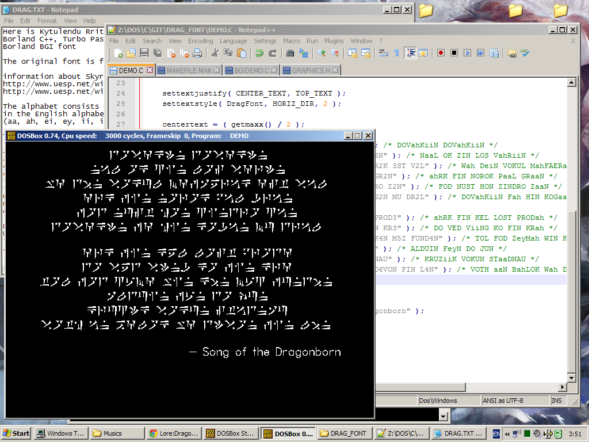

Borland BGI Skyrim Dragon font
==============================
Here is Khralkatorrix's Skyrim Dragon font for use with Turbo C/C++,
Borland C++, Turbo Pascal, Borland Pascal or what ever that support
Borland BGI font

The original font is from http://elderscrolls.wikia.com/wiki/Dragon_Alphabet

information about Skyrim Dragon language
http://www.uesp.net/wiki/Lore:Dragon_Alphabet
http://www.uesp.net/wiki/Lore:Dragon_Language

The alphabet consists of 34 symbols. 24 are mapped directly to letters
in the English alphabet (all letters except 'C'), and 9 that map to pairs of letters
(aa, ah, ei, ey, ii, ir,  ur, uu, oo).

To write those 9 letters, use the following buttons on your keyboard:

    aa: 2
    ah: 3
    ei: 4
    ey: 5
    ii: 6
    ir: 7
    ur: 8
    uu: 9
    oo: C

**Note:** You cannot type number using this font
While the "0" (zero) key also has a character mapped to it,
it is one that is not used and was discarded from the final version of the the game
and can be ignored.

The Elder Scrolls V : Skyrim is Copyright by Bethesda Softworks.
